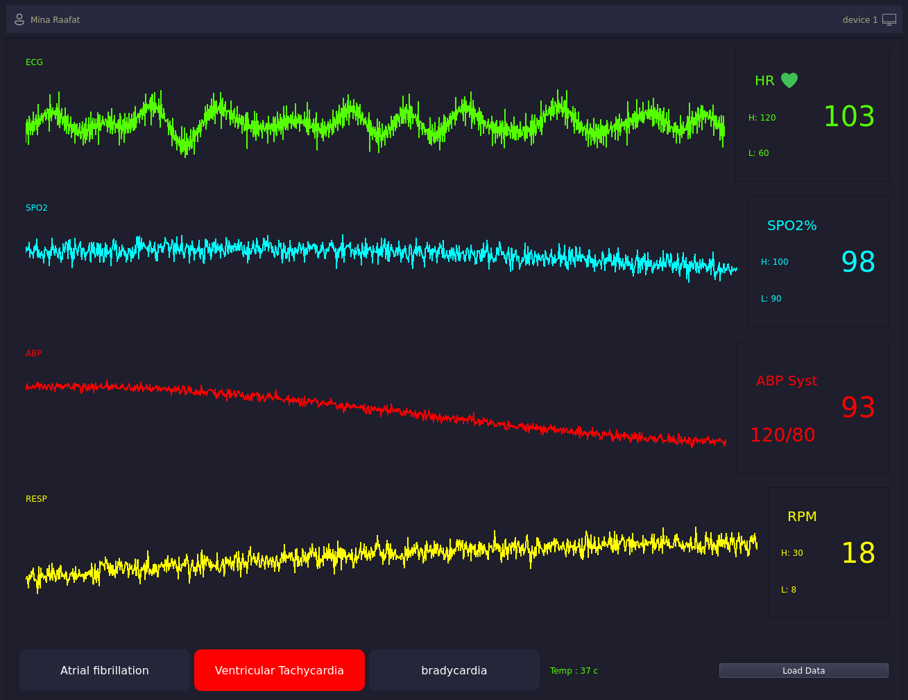
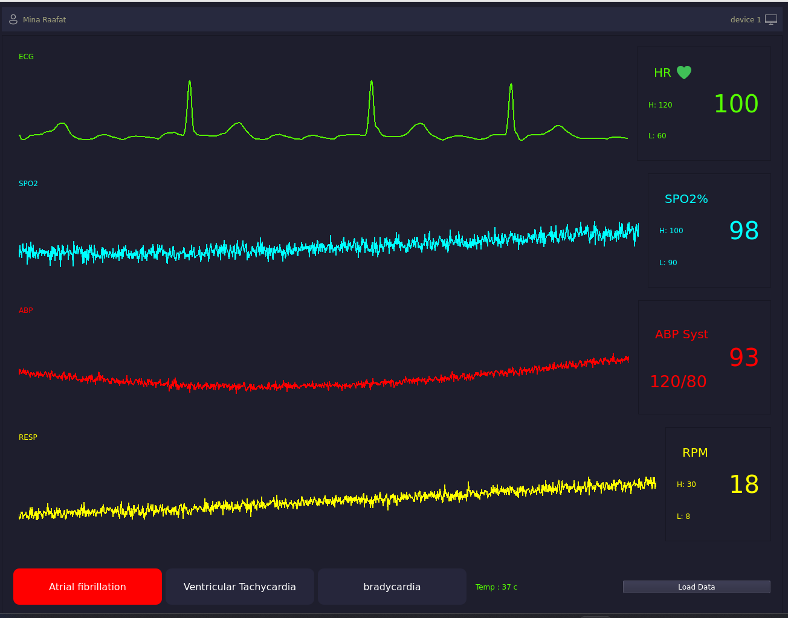

# Patient Monitor Application

This application simulates a patient monitoring system, displaying vital signs like ECG, SPO2, ABP, and RESP, calculating heart rate, and detecting potential cardiac abnormalities such as Atrial Fibrillation (AF), Ventricular Tachycardia (VT), and Bradycardia.

## Features

*   **Real-time Plotting:** Displays ECG, SPO2, ABP, and RESP waveforms.
*   **Data Loading:** Loads ECG data from `.mat` or `.csv` files.
*   **Heart Rate Calculation:** Calculates and displays the current heart rate based on ECG data.
*   **Arrhythmia Detection:**
    *   Detects Atrial Fibrillation (AF) based on RR interval variability (requires `.mat` file with `fs=360`).
    *   Detects Ventricular Tachycardia (VT) (HR > 100 BPM) and Bradycardia (HR < 60 BPM) (requires `.csv` file).
*   **Visual Alarms:** Highlights specific condition widgets (AF, VT, Bradycardia) when detected.
*   **Dummy Data:** Includes placeholder graphs for SPO2, ABP, and RESP.

## Requirements

*   Python 3.x
*   PyQt5
*   NumPy
*   SciPy
*   Pandas

## UI Previews

